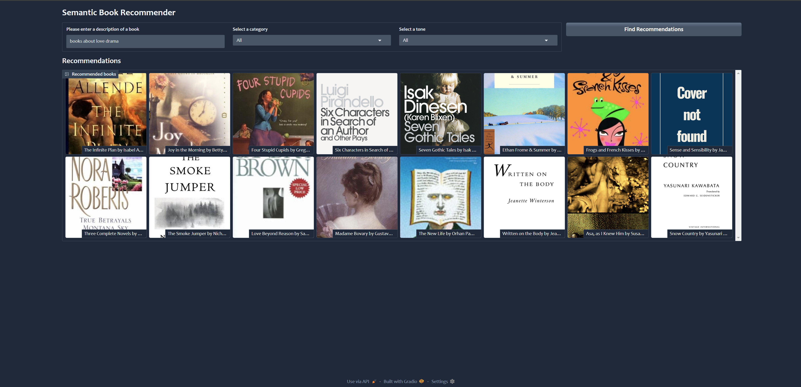
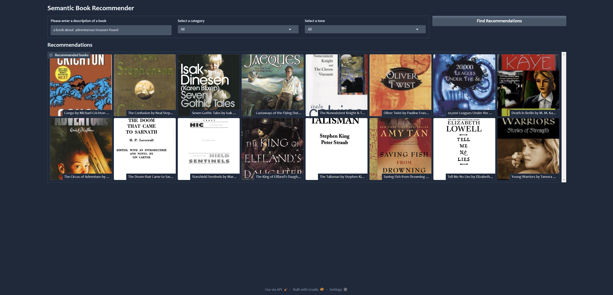
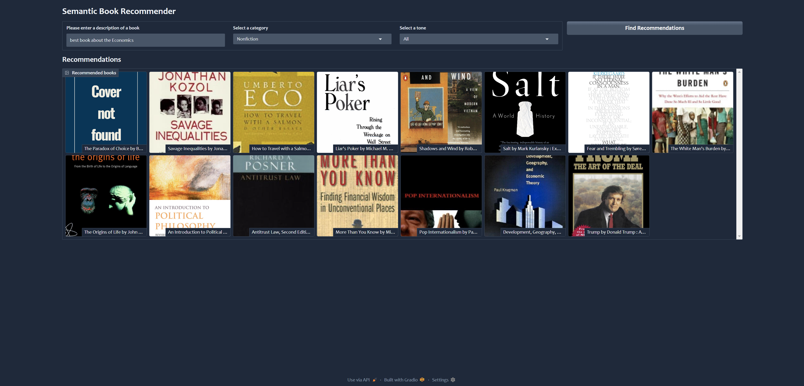
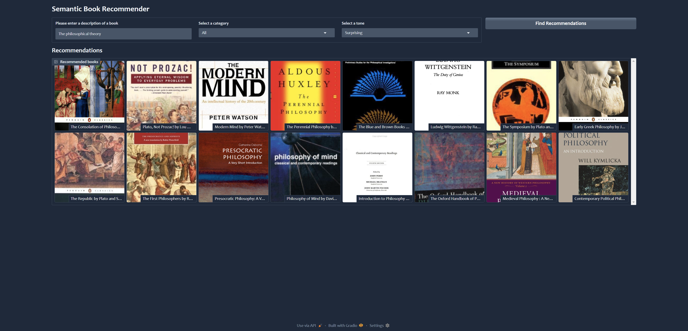
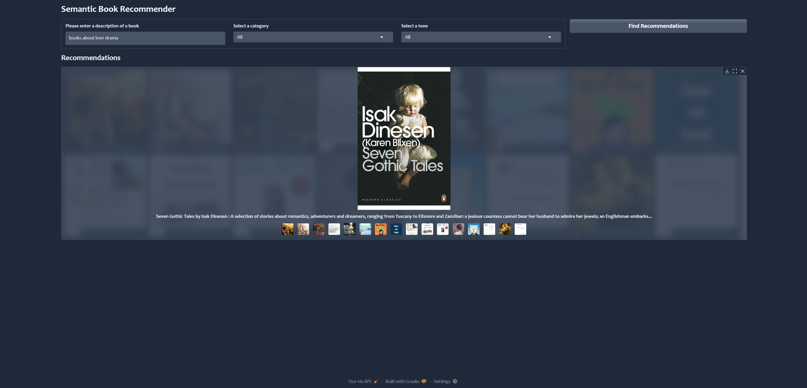

# Book Recommender System

This project is a Book Recommender System leveraging Large Language Models (LLMs) to provide personalized book recommendations. It incorporates text classification, document similarity checks, and sentiment analysis to enhance recommendation quality.

## Table of Contents

- [Overview](#overview)
- [Features](#features)
- [Dataset](#dataset)
- [Installation](#installation)
- [Usage](#usage)
- [Model Details](#model-details)
- [Results](#results)
- [Contributing](#contributing)
- [License](#license)

## Overview

The Book Recommender System aims to suggest books to users based on their reading preferences and interests. By utilizing advanced Natural Language Processing (NLP) techniques and LLMs, the system analyzes book content and user reviews to deliver accurate and personalized recommendations.

## Features  
- 📚 **Zero-Shot Text Classification** using `facebook/bart-large-mnli`  
- 🔍 **Document Similarity Analysis** to find books with similar themes  
- 😀 **Sentiment Analysis** to gauge user preferences  

---

## 🚀 Model Details  

### 1️⃣ **Zero-Shot Classification** (Fiction vs. Nonfiction)  
The system classifies books into **Fiction** or **Nonfiction** using **Facebook’s `bart-large-mnli`** model.  

```python
    from transformers import pipeline

    # Load Zero-Shot Classification Model
    pipe = pipeline("zero-shot-classification", model="facebook/bart-large-mnli", device=device)

    # Example classification
    fiction_categories = ["Fiction", "Nonfiction"]
    result = pipe("This book explores real-world historical events.", candidate_labels=fiction_categories)

    print(result)
```

**📌How it works:**
   - The book description is passed to the model.
   - The model assigns a confidence score for Fiction vs. Nonfiction.
   - The category with the higher confidence score is selected.

### 2️⃣ Document Similarity Check
To recommend similar books, we use text embeddings and cosine similarity.

**Approach:**
   - Convert book descriptions into vector embeddings using a pre-trained model.
   - Compute the cosine similarity between books. 
   - Recommend books with the highest similarity scores.

```python
from sklearn.metrics.pairwise import cosine_similarity

# Example: Compute similarity between two book descriptions
similarity_score = cosine_similarity([embedding_book1], [embedding_book2])
print(f"Similarity Score: {similarity_score[0][0]}")
```
**📌 Why this matters?**
   - Helps in finding books with similar writing style, themes, or topics.

### 3️⃣ Sentiment Analysis
   - The system analyzes user reviews to understand sentiment and refine recommendations.
```python
from transformers import pipeline

# Load Sentiment Analysis Model
sentiment_pipe = pipeline("sentiment-analysis")

# Example: Analyze user review
review = "I absolutely loved this book! The story was fantastic."
sentiment = sentiment_pipe(review)
print(sentiment)
```

**📌 How this helps?**
   - Books with positive sentiment from similar users are ranked higher.
   - Helps in personalized recommendations based on user sentiment.

## Dataset

The system utilizes the [Book-Crossing dataset](https://www.kaggle.com/datasets/dylanjcastillo/7k-books-with-metadata), which includes:

- **Users**: Anonymized user IDs with demographic information (Location, Age).
- **Books**: Details such as ISBN, Book-Title, Book-Author, Year-Of-Publication, Publisher, and cover image URLs.
- **Ratings**: Explicit ratings (1-10) and implicit interactions (0).

## Installation

To set up the project locally:

1. **Clone the repository**:

   ```bash
   git clone https://github.com/kvamsi7/recommendation-system.git
   cd recommendation-system/book-recommender
    ```
2. **Create and activate a virtual environment**
```bash
  python3 -m venv env
  source env/bin/activate  # On Windows, use `env\Scripts\activate`
```
3. **Install the required dependencies**
```bash
  pip install -r requirements.txt
```
## Usage
### After installation:
   1. **Prepare the dataset:** Ensure the Book-Crossing dataset files (Users.csv, Books.csv, Ratings.csv) are placed in the data/ directory.
   2. **Run the recommendation script:**
   ```bash
      python recommend.py
   ```
This will process the data, train the model, and output book recommendations based on the implemented algorithms.

## Model Details
The system employs a combination of NLP techniques and machine learning models:

**Text Classification:** Utilizes LLMs to assign genres to books based on their descriptions.
**Document Similarity:** Calculates similarity scores between books using cosine similarity on text embeddings.
**Sentiment Analysis:** Analyzes user reviews to determine the overall sentiment towards books, aiding in filtering recommendations.

## 📊 Results

### System Performance

The system has demonstrated effective performance in recommending books that align with user preferences. Below are sample results showcasing the recommendation interface.

### **Sample Book Recommendations**
*Figure: Sample book recommendations based on user input.*

#### **Without Filtering**
<p align="center">
  
  
</p>

---

### **Filtered Recommendations**

#### 📚 **Nonfiction Category**
<p align="center">
  
</p>

---

#### 🎭 **Surprising Category**
<p align="center">
  
</p>

---

### **Book Description View**
<p align="center">
  
</p>

--- 

## 📜 Conclusion
This book recommender system effectively combines Zero-Shot Classification, Document Similarity, and Sentiment Analysis to improve recommendation quality. It can be further expanded with user personalization and deep-learning-based embeddings for even better results.

## 🔗 References
   - [BART-Large-MNLI Model](https://huggingface.co/facebook/bart-large-mnli)
   - [Hugging Face Pipelines](https://huggingface.co/)

## 👨‍💻 Author
Developed by [kvamsi7](https://github.com/kvamsi7)

